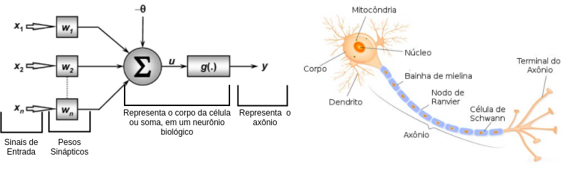

<h1 align="center">Neurônio Artificial</h1>

<h2  >Objetivo</h2>

Criação de um neurôno artificial utilizando a linguagem python.
 
obs.não foi implementado nenhuma classe

<h2>Resumo</h2>

Nesse projeto, foi desenvolvido um neurônio artificial.
 
Tentei implementar um único neurônio que passará por todas as etapas das:
<ul>
<li>entradas.</li>
<li>Função de soma.</li>
<li>Função de ativação. </li>
<li>Saída.</li>
</ul>
As entradas serão inseridas por uma constante, porém poderão ser inseridas variáveis pré-processadas. 
Exemplo: processar uma imagem fazendo com que cada píxel da imagem seja responsável por um bit.

Foi criado apenas um único neurônio, porém o código está livre para implementações.
Exemplos: desenvolver uma classe ou algo que possa maximizar o desempenho

<h3>Tecnologia </h3>

 
foi usado a linguagem <i>python</i> para o desenovlvimento do neurônio.